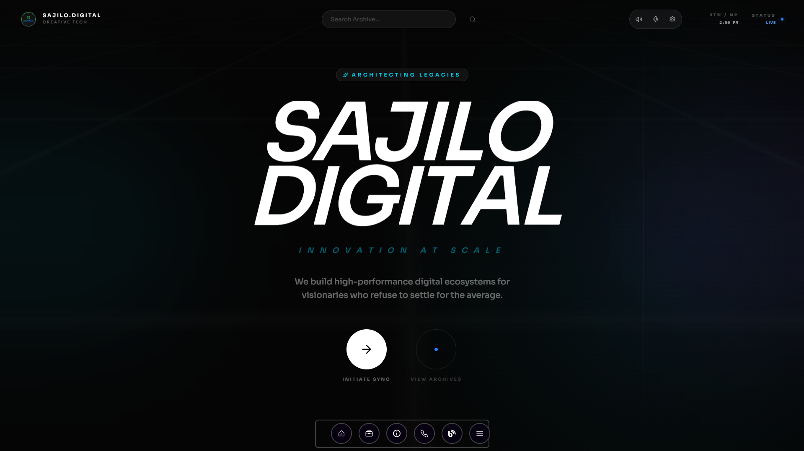

<div align="center">

```
   _____         _ _ _         ____  _       _ _        _
  |   __|___ ___|_| | |_ ___  |    \|_|___ _|_| |_ __ _| |
  |__   | .'| . | | | | . |   |  |  | | . | | |  _| .'|  |
  |_____|__,|___|_|_|_|___|   |____/|_|_  |_|_|_| |__,|_|
                                      |___|
```

<h3> Your Vision, Our Innovation.</h3>

<p>
  <a href="#-tech-stack">
    
  </a>
  <a href="#-tech-stack">
    
  </a>
  <a href="#-tech-stack">
    
  </a>
  <a href="#-tech-stack">
    
  </a>
   <a href="#-tech-stack">
    
  </a>
</p>

<p>
  <a href="#-key-features">Key Features</a> •
  <a href="#-tech-stack">Tech Stack</a> •
  <a href="#-fun-facts--easter-eggs">Easter Eggs</a> •
  <a href="#-getting-started">Getting Started</a> •
  <a href="#-developer">Developer</a>
</p>

</div>

---

## The Vibe

**Sajilo Digital** is not just a website; it's a **digital ecosystem**. Built with the bleeding-edge stack of 2026, it merges cinematic aesthetics with high-performance architecture. We believe in "Code as Poetry" — where every pixel has a purpose, and every interaction feels like magic.

> _"Design is not just what it looks like and feels like. Design is how it works."_

## Key Features

- ** Cyberpunk Interface**: A visual language defined by grain overlays, glassmorphism, and neon accents.
- ** Nexus Terminal**: A fully functional, web-based CLI. Navigate the site, run system diagnostics, or hack the mainframe.
- ** Cinematic Animations**: Powered by **GSAP** and **Framer Motion** for buttery smooth transitions and scroll effects.
- ** Neural UX**: Interfaces that anticipate user intent, creating a seamless flow from landing to conversion.
- ** Dark Mode Native**: Optimized for visually stunning dark themes that pop on OLED screens.

## Gallery

|              **Home Hero**               | **Nexus Terminal** |
| :--------------------------------------: | :----------------: |
|  | _Terminal Preview_ |
|            _Cinematic Entry_             | _Interactive CLI_  |

## 🛠 Tech Stack

Our arsenal includes the latest and greatest in web technology:

### Core Architecture

- **Framework**: [Next.js 16](https://nextjs.org/) (App Router)
- **Library**: [React 19](https://react.dev/)
- **Language**: [TypeScript](https://www.typescriptlang.org/)

### Styling & Motion

- **Styling**: [Tailwind CSS v4](https://tailwindcss.com/)
- **Animation**: [GSAP](https://greensock.com/), [Framer Motion](https://www.framer.com/motion/)
- **Particles**: [tsParticles](https://github.com/tsparticles/tsparticles)

### Utilities

- **Icons**: [Lucide React](https://lucide.dev/)
- **State/logic**: Custom Hooks, React Query

## Fun Facts & Easter Eggs

The **Nexus Terminal** (`src/components/home/NexusTerminal.tsx`) is hiding secrets. Can you find them all?

- **The Matrix**: Type `matrix` to unleash the digital rain.
- **Caffeine Fix**: Try typing `coffee`. Warning: Server may be a teapot.
- **System Stats**: Type `neofetch` for a nerd-approved system summary.
- **Hacking**: Type `hack`. _Disclaimer: No actual government databases will be harmed._
- **Echo**: `echo [message]` makes the terminal speak back.

## Future Improvements

We are constantly iterating. Here is what is on the horizon:

- **Working Timeline**: Project working timeline in real time with updates .
- **Project Brain**: AI-powered cost and timeline estimator.

## Getting Started

Initialize the sequence locally:

1.  **Clone the Repository**

    ```bash
    git clone https://github.com/sajilodigital/sajilo-digital.git
    cd sajilo-digital
    ```

2.  **Install Dependencies**

    ```bash
    pnpm install
    ```

3.  **Ignite the Server**

    ```bash
    pnpm dev
    ```

4.  **Access Localhost**
    Open [http://localhost:3000](http://localhost:3000) to view the project.

## 👨‍💻 Developer & Contact

**Architected & Engineered by:**

<div align="left">
  <h3>Arun Neupane <span style="font-size: 14px; opacity: 0.6;">(CTO)</span></h3>
  <p><i>"Architecting digital legacies for global visionaries."</i></p>
</div>

- **Role**: Chief Technology Officer (CTO)
- **Handle**: `/arundada9000`
- **Location**: Horizon Chowk, Butwal, Nepal
- **Socials**:
  - [Facebook](https://facebook.com/in/arunneupane)
  - [GitHub](https://github.com/arundada9000)
  - [Instagram](https://github.com/arundada9000)
  - [Youtube](https://youtube.com/@arundada9000)

---

<div align="center">
  <small>&copy; 2026 Sajilo Digital. All Systems Operational.</small>
</div>
